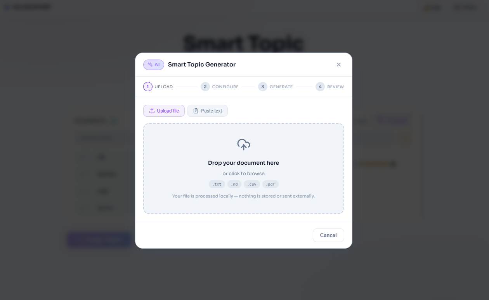
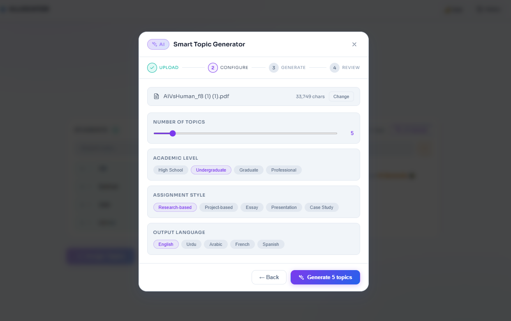
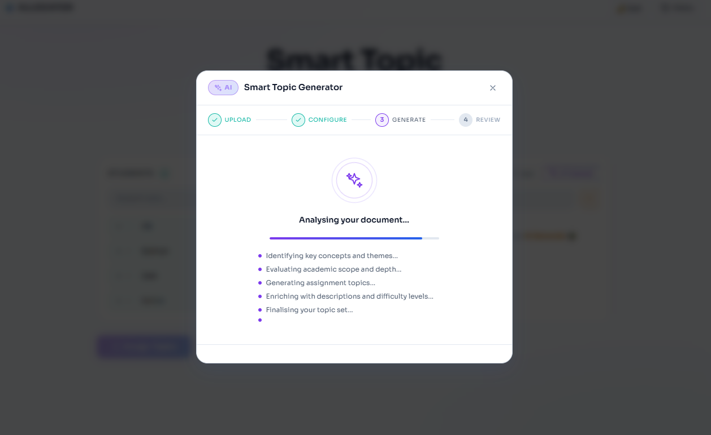
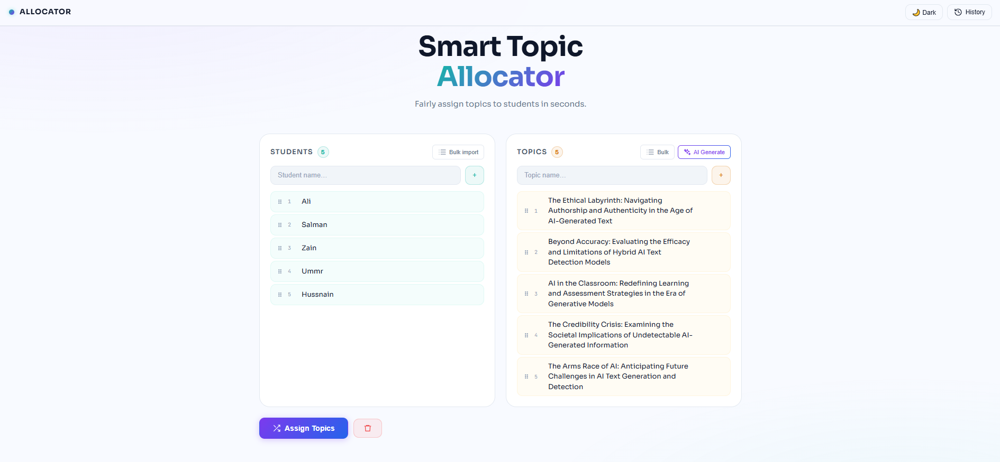
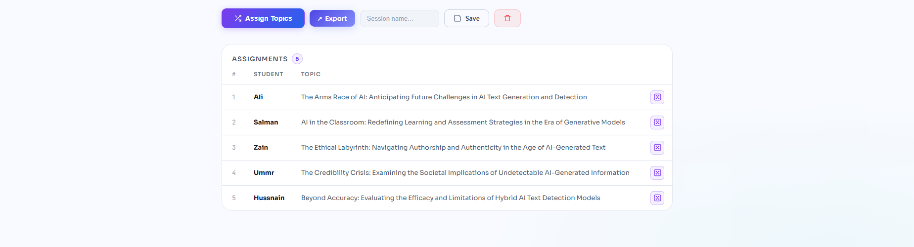
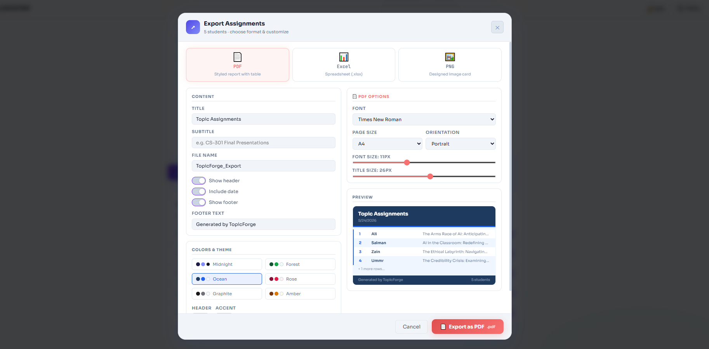
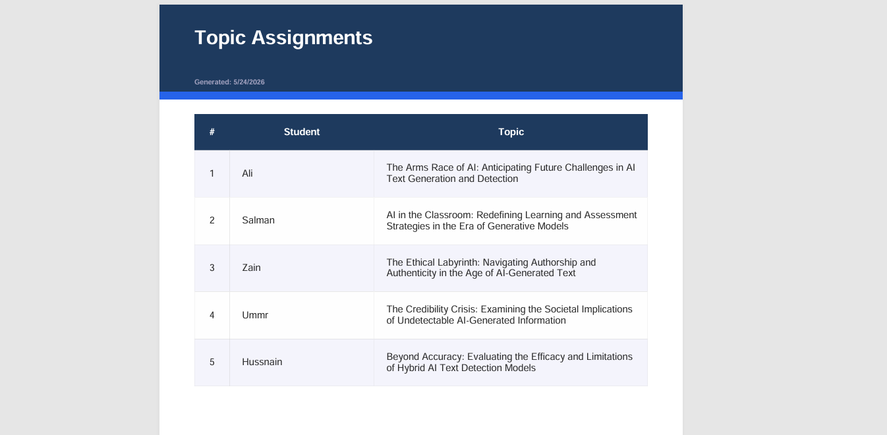
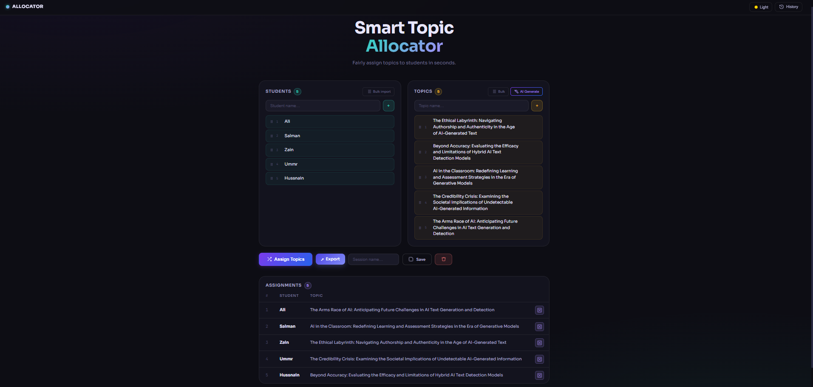

# 🎓 Smart Topic Allocator (AI-Powered)


> An advanced AI-powered academic platform that automatically generates, assigns, manages, and exports student assignment topics using Google Gemini AI and modern frontend engineering.

---

## 🚀 Live Demo

🔗 Frontend Demo: https://random-allocator.netlify.app/

---

## 📸 Screenshots

### 🖥️ Upload File


### ⚙️ Select Options


### 🤖 Generating Topics


### 📄 Generated Topics


### 🧑‍🏫 Dashboard


### 📌 Allocated Topics


### 📤 Export Modal


### 📦 Export Output


### 🌙 Dark Mode


---

## ✨ Key Features

### 🤖 AI-Powered Topic Generation
- Powered by **Google Gemini API**
- Generates structured academic assignment topics
- Includes:
  - Title
  - Description
  - Difficulty level
  - Estimated hours
  - Tags
- Multi-language support (English, Urdu, Arabic, French, Spanish)
- Supports academic levels (High School → Graduate)

---

### 🎓 Smart Assignment System
- Automatic topic distribution
- Fair assignment logic
- Manual re-roll per student
- Conflict detection system

---

### 📂 Bulk Import System
- Paste or upload data instantly
- Supports `.txt`, `.csv`, `.md`, `.pdf`
- Drag & drop support
- Live preview before import

---

### 🧠 AI Document Understanding
- Upload syllabus, notes, or research papers
- AI extracts key concepts
- Generates structured topics
- Summarizes content automatically

---

### 📤 Export System

#### 📄 PDF Export
- Styled academic reports
- Tables with formatting
- Custom header/footer
- Page numbering

#### 📊 Excel Export
- Multi-sheet workbook
- Metadata sheet included
- Freeze header support

#### 🖼️ PNG Export
- High-quality canvas rendering
- Theme-based design
- Shareable visuals

---

### 📊 Session Management
- Save multiple sessions
- Load previous data anytime
- Delete/manage history
- Persistent storage support

---

### 🎨 UI/UX System
- Framer Motion animations
- Drag & Drop support
- Dark/Light mode
- Glassmorphism design
- Fully responsive UI

---


## 🧠 AI Workflow

```txt
Upload / Paste Document
        ↓
Extract Raw Text
        ↓
Gemini AI Processing
        ↓
Generate Structured Topics
        ↓
Select Topics
        ↓
Assign to Students
        ↓
Export (PDF / Excel / PNG)
